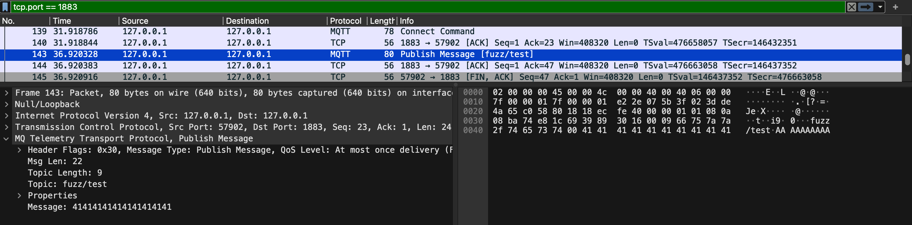

When it comes to finding vulnerabilities in a piece of software, it usually takes a lot of time and effort. So how do we minimize that time and effort while maximizing the number of vulnerabilities we can find? How does one automate the process of finding vulnerabilities? The answer here is **fuzzing**.

## What is fuzzing?

A fun little analogy for fuzzing that a friend of mine uses is "*throwing a bunch of darts and seeing which one hits the bullseye*". That kinda sums up what fuzzing is: A brute-force method for finding vulnerabilities.

Fuzzing works by generating a bunch of different inputs for a program and testing those inputs. Those inputs may trigger certain unexpected behaviors or crash the program, indicating a vulnerability. This method of finding vulnerabilities works very well for large, complex programs that might have numerous lines of code that could cause vulnerabilities under the right conditions. By using fuzzing, we can almost forgo the process of manually tracing and finding the vulnerable parts of the project.

The purpose of this blog post is to give you a little bit of insight into fuzzing along with showing you how to setup a black box generation-based fuzzer.

## Different types of fuzzing

Generally, there are 2 different types of fuzzing:

- **Mutation-based**: Generate inputs by mutating an initial corpus of valid inputs.
- **Generation-based**: Generates inputs based on a predefined input format specification

We can also classify fuzzers based on the type of feedback loop they use:

- **"Dumb" fuzzers** uses simple feedback such as hangs or crashes to identify successful test cases.
- **"Smart" fuzzers** uses heuristics and coverage feedback to optimize input generation based on the exploration strategy.

You might be asking why should we use "dumb" fuzzers when we have the "smart" ones. Well it's because some fuzzing is always better than no fuzzing. "Dumb" fuzzers are the quick and dirty way of fuzzing. They're not difficult to setup and can help us identify some low-hanging fruits quickly and efficiently. Additionally, information gathered from "dumb" fuzzers can help guide "smart" fuzzing later on.

For this blog post, we'll setup a generation-based fuzzer for fuzzing MQTT with [*boofuzz*](https://github.com/jtpereyda/boofuzz). Before we start setting up the fuzzer, we need to understand the MQTT protocol.

## The MQTT protocol

> This isn't the complete specification of the protocol. I'll just point out the parts that I think is interesting.

The MQTT protocol is a standard that's been documented [*here*](https://mqtt.org/mqtt-specification/). An MQTT TCP packet consists of these components:

- **Fixed header**: This header is required for each MQTT packet. It includes a 4-bit control packet–type unsigned value, 4-bit flags, and a 1 to 4-byte variable-byte integer that represents the number of bytes remaining in the current control packet.
- **Variable header**: This header is optional. Its contents vary depending on the control packet type.
- **Payload** The payload of the packet.

When gathering information about a target's specification for generation-based fuzzing, we should focus on specifications about the sequence of the target since we need to get the sequence correct to reach deep into the target. The main focus in this blog post will be on the `PUBLISH` packet, which can be sent after sending the `CONNECT` packet.

## Setting up boofuzz

[*Boofuzz*](https://github.com/jtpereyda/boofuzz) is a generation-based fuzzing framework for networking protocols. Boofuzz is relatively simple to setup since we have the specification of the protocol. 

> Side note: For proprietary protocols, mutation-based fuzzers would be better since we don't have access to the detailed specifications of the protocol. We'd only need an initial corpus like a packet capture file to mutate.

You can see the full script [**here**](https://gist.github.com). I'll explain in details what each parts of the script does.

Our goal here is to fuzz the message component of the `PUBLISH` packet. We can only send a `PUBLISH` packet after sending a `CONNECT` packet to an MQTT broker, so we need to setup our fuzzer such that it can send the `CONNECT` packet before sending the `PUBLISH` packet.

### Creating the fuzzing session

First, we need to create a fuzzing session.

```py
def create_session(host: str, port: int):
    target = Target(connection=TCPSocketConnection(host=host, port=port))
    session = Session(target=target)
    return session
```

This function create a session object using a host IP and port. We'll be using `127.0.0.1` and `1883` (Default MQTT port).

### Defining the CONNECT packet

We'll need to define the specification of the `CONNECT` packet for boofuzz.

```py
def build_connect_packet(client_id: str):
    s_initialize("Connect)
    with s_block("FixedHeader):
        # CONNECT packet type
        s_bit_field(
            value=0b00010000,
            width=8,
            fuzzable=False,
            name="ControlPacketType",
        )

        # Remaining Length
        s_size(
            block_name="Remaining",
            fuzzable=False,
            length=1,
            endian=BIG_ENDIAN,
            name="RemainingLength",
        )

        with s_block("Remaining):
            with s_block("VariableHeader):
                s_size(
                    block_name="ProtocolName",
                    fuzzable=False,
                    length=2,
                    endian=BIG_ENDIAN,
                    name="ProtocolNameLength",
                )
                with s_block("ProtocolName):
                    s_string(value="MQTT", fuzzable=False)

                # Protocol version (MQTT 5.0)
                s_byte(value=5, fuzzable=False, name="ProtocolVersion)

                # Connect Flags
                s_byte(value=2, fuzzable=False, name="ConnectFlags)

                # Keep Alive
                s_word(value=60, fuzzable=False, endian=BIG_ENDIAN, name="KeepAlive)

                # Properties
                with s_block("Properties):
                    s_byte(value=0, fuzzable=False, name="PropertiesLength)

            with s_block("Payload):
                s_size(
                    block_name="ClientID",
                    fuzzable=False,
                    length=2,
                    endian=BIG_ENDIAN,
                    name="ClientIDLength",
                )
                with s_block("ClientID):
                    s_string(value=client_id, fuzzable=False)
```

This function builds the `CONNECT` packet according to the 3 main components of a typical MQTT packet (Fixed header, variable header, payload) that we discussed in the previous section.

The first byte of every MQTT packet specifies the type of the packet (First 4 bits) and the flags of the packet (Last 4 bits). `CONNECT` has a control packet type byte of `00010000` (Specs in the below image). The `fuzzable` parameter indicates whether boofuzz should try to fuzz that component. In this case, since we're not trying to fuzz the `CONNECT` packet, we'll set all the `fuzzable` parameters to false.


`RemainingLength` specifies the remaining length of the packet in bytes, which is the number of bytes of both the variable header and the payload.

For the `VariableHeader`, we first specify the protocol name, which is `MQTT`. Then we specify that the MQTT version that we're using is 5.0 with `ProtocolVersion`. Next, for the `ConnectFlags` (Specs in the below image), this is a 1-byte field. We're using 2 for the `ConnectFlags` field for a clean start since we're not fuzzing for username or password or anything like that.


`KeepAlive` is a 2-byte time interval. We're just going to set this to 60. `Properties` can contain extra information about the packet. For our use case, we're not going to need this component so we can just set the `PropertiesLength` to 0.

For the `Payload`, we only need to specify 2 things: `ClientIDLength` and `ClientID`. With that, our `CONNECT` packet is done.

### Defining the PUBLISH packet

Here's the interesting part, we'll define the specification of the `PUBLISH` packet here so that boofuzz can fuzz it. We'll be fuzzing the application message of the `PUBLISH` packet.

```py
def build_publish_packet(topic: str):
    s_initialize("Publish)
    with s_block("FixedHeader):
        # PUBLISH packet type
        s_bit_field(
            value=0b00110000,
            width=8,
            fuzzable=False,
            name="ControlPacketType",
        )

        # Remaining Length
        s_size(
            block_name="Remaining",
            fuzzable=False,
            length=1,
            endian=BIG_ENDIAN,
            name="RemainingLength",
        )

        with s_block("Remaining):
            with s_block("VariableHeader):
                s_size(
                    block_name="TopicName",
                    fuzzable=False,
                    length=2,
                    endian=BIG_ENDIAN,
                    name="TopicNameLength",
                )
                with s_block("TopicName):
                    s_string(value=topic, fuzzable=False)

                # Properties
                with s_block("Properties):
                    s_byte(value=0, fuzzable=False, name="PropertiesLength)

            with s_block("Payload):
                # Fuzz application message
                s_bytes(fuzzable=True, name="ApplicationMessage)
```

`ControlPacketType` and `RemainingLength` is pretty much the same here. The `PUBLISH` packet has a `ControlPacketType` byte of `00110000` instead. For the `VariableHeader`, we're specifying the topic name in almost the same way we would specify the protocol name in the `CONNECT` packet. We also don't have any extra properties so we set `PropertiesLength` to 0.

The interesting part is in `Payload`. Here's, we're fuzzing the `ApplicationMessage` field, we don't need to specify a value for this as boofuzz will generate those values for us.

### Starting the fuzzer

We need to give the script a host, a port, a client ID, and an MQTT topic to start fuzzing.

```py
build_connect_packet(client_id=args.client)
build_publish_packet(topic=args.topic)
session = create_session(host=args.host, port=args.port)
```

Additionally, we also need to specify that the `PUBLISH` packet should only be sent after the `CONNECT` packet. Then we can start fuzzing.

```py
session.connect(s_get("Connect))
session.connect(s_get("Connect), s_get("Publish))
session.fuzz()
```

And Voilà, our MQTT fuzzer is now done. Below is an image of an example fuzzing case captured by Wireshark.



## Fuzzing Eclipse Mosquitto

Using our boofuzz script, we can start fuzzing [*Eclipse Mosquitto*](https://github.com/eclipse-mosquitto/mosquitto) (An open source MQTT broker). You can build the broker from source or install it via a package manager like [*Homebrew*](https://brew.sh/).

We can start mosquitto by just typing this in the command line.

```sh
mosquitto
```

The broker will start running an listening on port 1883. Next, we can start our fuzzing script.

```sh
python fuzzer.py --host 127.0.0.1 --port 1883 --client Client1 --topic fuzz/test
```

Additionally, we can also view the current status of boofuzz through its web interface located at port 26000 as seen below.


## Conclusion

Fuzzing is a great method for automating the process of finding vulnerabilities in large software. I think fuzzing is a powerful tool that any security researchers and security engineers should have under their belt. I hope this blog post can get you interested in fuzzing.

**Discussion**: I'm really excited about the possibility of applying AI to fuzzing. Large Language Models have gotten increasingly powerful, there's so many uncharted territory in this intersection and I really want to look deeper into this area. 
